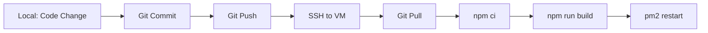

# 📦 Thai MOOC - Production Deployment Files

ไฟล์และสคริปต์สำหรับ Deploy โปรเจค Thai MOOC ไปยัง Google Cloud VM

---

## 📂 ไฟล์ที่สร้างให้แล้ว

### 📄 Configuration Files
- **`.env.production.example`** - Template สำหรับ environment variables
- **`ecosystem.config.js`** - PM2 configuration
- **`nginx.conf`** - Nginx reverse proxy configuration

### 🔧 Scripts (ใน folder `scripts/`)
- **`vm-setup.sh`** - ติดตั้ง software บน VM (Node.js, MySQL, Nginx, PM2)
- **`setup-database.sh`** - สร้าง database และ user
- **`deploy.sh`** - Deploy/Update application
- **`export-database-schema.sh`** - Export database จาก local

### 📚 Documentation
- **`QUICK_DEPLOY.md`** - คู่มือย่อ (30-45 นาที)
- **`DEPLOYMENT_GUIDE_GCP.md`** - คู่มือฉบับเต็ม
- **`README_DEPLOYMENT.md`** - ไฟล์นี้

### 🗄️ Database Exports (สร้างแล้ว)
- **`thai_mooc_schema.sql`** - โครงสร้างตารางเท่านั้น
- **`thai_mooc_full_backup.sql`** - ข้อมูลทั้งหมด (รวม schema)

---

## 🚀 วิธีใช้งาน

### สำหรับผู้ที่ต้องการ Deploy ครั้งแรก

1. **อ่านคู่มือ:**
   - เริ่มจาก [`QUICK_DEPLOY.md`](QUICK_DEPLOY.md) - คู่มือย่อ ใช้เวลา 30-45 นาที
   - หรือ [`DEPLOYMENT_GUIDE_GCP.md`](DEPLOYMENT_GUIDE_GCP.md) - คู่มือฉบับเต็ม มีรายละเอียดครบถ้วน

2. **เตรียมข้อมูล:**
   - Google Cloud VM instance (Ubuntu 22.04, 2 vCPU, 8GB RAM)
   - External IP address
   - Domain name (ถ้ามี)

3. **ทำตามขั้นตอนในคู่มือ:**
   - Setup VM
   - Install software
   - Deploy application
   - Configure Nginx
   - Install SSL certificate

---

## 📋 Requirements

### Hardware (VM Specs)
```yaml
Minimum:
  CPU: 2 vCPU
  RAM: 4 GB
  Disk: 30 GB SSD

Recommended:
  CPU: 2 vCPU
  RAM: 8 GB
  Disk: 50 GB SSD
  Region: asia-southeast1 (Singapore)
```

### Software
```
OS: Ubuntu 22.04 LTS
Node.js: 20.x LTS
MySQL: 8.0
Nginx: Latest
PM2: Latest
Certbot: Latest (for SSL)
```

### Network
```
Ports: 80 (HTTP), 443 (HTTPS)
Firewall: Allow HTTP & HTTPS traffic
```

---

## 🔐 Security Checklist

ก่อน Deploy ให้ตรวจสอบ:

- [ ] เปลี่ยน MySQL root password
- [ ] สร้าง database user แยกต่างหาก (ไม่ใช้ root)
- [ ] ตั้งค่า `NEXTAUTH_SECRET` ที่แข็งแรง
- [ ] เปิดเฉพาะ ports ที่จำเป็น
- [ ] ติดตั้ง SSL certificate
- [ ] ตั้งค่า firewall (UFW)
- [ ] อัพเดท system packages
- [ ] ตั้งค่า backup อัตโนมัติ

---

## 📊 ค่าใช้จ่ายโดยประมาณ (Google Cloud)

```
VM (n2-standard-2): ~$70/month
Static IP: ~$7/month (ถ้าใช้)
Disk (50GB SSD): ~$8/month
Bandwidth: ~$10-20/month

Total: ~$95-105/month
```

**หมายเหตุ:** ราคาอาจแตกต่างกันตาม region และการใช้งานจริง

---

## 🎯 Quick Commands

### บนเครื่อง Local
```bash
# Export database
bash scripts/export-database-schema.sh

# Upload to VM
gcloud compute scp thai_mooc_full_backup.sql YOUR_VM:/tmp/
```

### บน VM
```bash
# Setup VM (ครั้งแรก)
bash scripts/vm-setup.sh

# Setup database
bash scripts/setup-database.sh

# Deploy application
bash scripts/deploy.sh

# Update (ครั้งต่อไป)
git pull && bash scripts/deploy.sh
```

### Monitoring
```bash
# PM2
pm2 status
pm2 logs thai-mooc
pm2 monit

# Nginx
sudo systemctl status nginx
sudo tail -f /var/log/nginx/thai-mooc.access.log

# MySQL
sudo systemctl status mysql
```

---

## 🔄 Update Workflow



---

## 🆘 Troubleshooting

### Application ไม่ทำงาน
```bash
pm2 logs thai-mooc --err
pm2 restart thai-mooc
```

### 502 Bad Gateway
```bash
pm2 status  # ตรวจสอบว่า app รันอยู่
sudo systemctl restart nginx
```

### Database Connection Error
```bash
mysql -u thai_mooc_user -p thai_mooc
# ตรวจสอบ .env และ DATABASE_URL
```

### Out of Memory
```bash
# เพิ่ม swap space
sudo fallocate -l 2G /swapfile
sudo chmod 600 /swapfile
sudo mkswap /swapfile
sudo swapon /swapfile
echo '/swapfile none swap sw 0 0' | sudo tee -a /etc/fstab
```

---

## 📞 Support Resources

- **Documentation**: อ่าน [`DEPLOYMENT_GUIDE_GCP.md`](DEPLOYMENT_GUIDE_GCP.md)
- **Quick Start**: อ่าน [`QUICK_DEPLOY.md`](QUICK_DEPLOY.md)
- **Google Cloud Docs**: https://cloud.google.com/compute/docs
- **Next.js Deployment**: https://nextjs.org/docs/deployment

---

## ✅ Deployment Checklist

### Pre-Deployment
- [ ] Export database schema
- [ ] Update code to latest version
- [ ] Test locally
- [ ] Review environment variables
- [ ] Backup current production (ถ้ามี)

### Deployment
- [ ] SSH to VM
- [ ] Pull latest code / Upload files
- [ ] Install dependencies (`npm ci`)
- [ ] Build application (`npm run build`)
- [ ] Update environment variables
- [ ] Import database (ถ้าจำเป็น)
- [ ] Restart application (`pm2 restart`)
- [ ] Clear cache (ถ้ามี)

### Post-Deployment
- [ ] Test website accessibility
- [ ] Check PM2 logs
- [ ] Verify database connection
- [ ] Test admin panel
- [ ] Test file uploads
- [ ] Check SSL certificate
- [ ] Monitor for errors (15-30 นาที)
- [ ] Create backup

---

## 🎉 Ready to Deploy!

คุณพร้อม Deploy แล้ว! เลือกคู่มือที่เหมาะกับคุณ:

- 🚀 **ต้องการความรวดเร็ว?** → อ่าน [`QUICK_DEPLOY.md`](QUICK_DEPLOY.md)
- 📚 **ต้องการรายละเอียดครบถ้วน?** → อ่าน [`DEPLOYMENT_GUIDE_GCP.md`](DEPLOYMENT_GUIDE_GCP.md)

Good luck! 🍀
